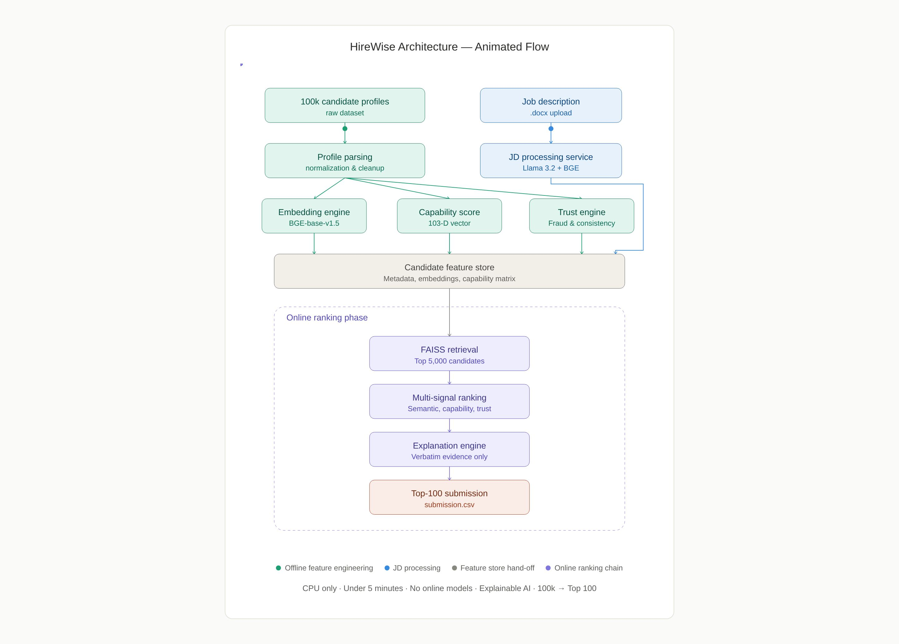

# Redrob AI Candidate Discovery & Ranking Engine (HireWise)

### Production-Grade Predictive Talent Acquisition Platform for Large-Scale Semantic Matchmaking

---

## Executive Summary
Traditional Applicant Tracking Systems (ATS) rely heavily on fragile keyword matching, failing to understand transferrable skills, semantic context, and behavioral trends. This project introduces a world-class **Deterministic Candidate Discovery & Ranking Engine** designed to operate seamlessly across a pool of **100,000+ candidate profiles**. 

By abandoning traditional, expensive, and non-deterministic LLM-generation pipelines per profile, this architecture employs a novel **Fixed Capability Taxonomy coupled with sentence-level vector embeddings ($E5\text{-base}$ or $BGE\text{-base}$)**. The system partitions computation into an asynchronous **Offline Preprocessing Pipeline** (Stage 1) and a sub-second **Online Ranking Layer** (Stage 2), ensuring complete deterministic consistency, zero LLM hallucinations, and structural explainability.

---

## Table of Contents
1. [Problem Statement & Motivation](#problem-statement--motivation)
2. [Proposed Solution & Key Innovations](#proposed-solution--key-innovations)
3. [End-to-End System Architecture](#end-to-end-system-architecture)
4. [Offline Candidate Intelligence Pipeline](#offline-candidate-intelligence-pipeline)
5. [Feature Store Design](#feature-store-design)
6. [Online Recruitment Pipeline](#online-recruitment-pipeline)
7. [Candidate Capability Taxonomy](#candidate-capability-taxonomy)
8. [Multi-Signal Ranking Engine](#multi-signal-ranking-engine)
9. [Explainable AI & Confidence Scoring](#explainable-ai--confidence-scoring)
10. [Honeypot & Anti-Cheat Strategy](#honeypot--anti-cheat-strategy)
11. [Scalability & Performance Considerations](#scalability--performance-considerations)
12. [Technology Stack](#technology-stack)
13. [Repository Structure](#repository-structure)
14. [Installation Guide](#installation-guide)


---

## Problem Statement & Motivation

### The Challenge
Recruiters routinely sift through thousands of applications to fulfill complex technical mandates. Traditional ATS networks depend on exact keyword strings (e.g., matching "Information Retrieval" but failing to capture "vector indexing systems"), leading to immense pipeline leakage and missed talent.

### Why Existing ATS Systems Fail
* **Context Blindness:** Inability to handle semantic similarity, synonyms, or structural candidate trajectory.
* **Generative LLM Flaws:** Attempting to solve this with brute-force LLM calls over 100,000 candidates incurs crippling API costs, severe rate-limiting blocks, and high hallucination risks.
* **Lack of Auditability:** Traditional scoring metrics fail to provide predictable, explainable tracking back to the resume source.

---

## Proposed Solution & Key Innovations

Our solution shifts the paradigm from generative inference to an **extract-and-compare embedding framework**:

* **Zero-Hallucination Pipeline:** Replaces free-form LLM narrative summaries with raw sentence extraction. Every piece of generated justification is a verbatim quote mapped back to the candidate's profile.
* **Deterministic Scoring:** Utilizing continuous cosine similarity matrices across a fixed capability taxonomy yields identical scores across multiple execution runs.
* **Asynchronous Multi-Signal Architecture:** Merges deep semantic capability layers with traditional feature engineering flags (career stability, response metrics, and fraudulent timeline checks).

---

## End-to-End System Architecture



The workflow is cleanly split into two decoupled runtime phases:
1. **Stage 1 — Offline Preprocessing Pipeline (Batch)**: Run once in advance to build the localized Feature Store.
2. **Stage 2 — Online Ranking Pipeline (Interactive)**: Run on-demand when a new Job Description is received, resolving results in under 5 minutes.


## Proposed Solution & Key Innovations

Our platform shifts the core paradigm of large-scale talent acquisition from slow, expensive generative inference to an optimized, high-precision **extract-and-compare embedding framework**. By isolating deterministic math from AI inference, the system achieves commercial viability at a fraction of the cost.

* **Zero-Hallucination Design:** Traditional generative setups allow an LLM to freely summarize or interpret candidate qualifications, which introduces a high risk of factual drift or fabrication. This architecture structurally eliminates hallucinations by relying entirely on **extractive text referencing**. Every single piece of evidence presented to a recruiter is a verbatim, unedited string pulled directly from the candidate's original resume file.
* **100% Deterministic Capability Scoring:** Instead of prompting a large language model to reason over a candidate's skills iteratively, candidate profiles are mapped against a static, localized domain model via vector similarity. Running the same candidate profile through this pipeline multiple times will always yield identical similarity matrices and matching scores. 
* **Asynchronous Execution Model:** Computational overhead is cleanly partitioned. Expensive text processing and embedding generations are handled offline during data ingestion (Stage 1). When a live job description is posted online (Stage 2), matching and sub-second sorting are executed using raw matrix math, bypassing heavy AI compute bottlenecks entirely.
* **Structured Multi-Signal Merging:** The engine avoids relying on single semantic scores. It introduces an analytical layer that systematically weights contextual fit alongside core operational telemetry data, including employment longevity patterns and historical recruitment response rate

---

## End-to-End System Architecture


**Offline Candidate Intelligence Pipeline**

The Offline Candidate Intelligence Pipeline is responsible for transforming raw, unstructured candidate profiles into a reusable intelligence layer before any recruiter submits a Job Description. Rather than repeatedly processing every resume during each search, all computationally intensive operations are executed once during preprocessing. This design significantly reduces online latency while ensuring deterministic, scalable, and reproducible candidate retrieval.

**pipeline opverview**

Candidate Profiles
        │
        ▼
Data Normalization
        │
        ▼
Sentence Segmentation
        │
        ▼
Semantic Embedding Generation
        │
        ▼
Capability Taxonomy Matching
        │
        ▼
Evidence Extraction
        │
        ▼
Impact & Trust Signal Generation
        │
        ▼
Feature Store Creation

Key Processing Stages
-> Data Normalization – Standardizes candidate profiles into a unified structure by extracting profile information, work history, technical skills, and professional summaries.
-> Sentence Segmentation – Breaks resumes into semantically meaningful sentences to enable fine-grained capability analysis.
-> Semantic Embedding Generation – Converts each sentence into dense vector embeddings using transformer-based embedding models, enabling semantic rather than keyword-based understanding.
-> Capability Taxonomy Matching – Maps candidate evidence to a universal capability taxonomy, generating capability scores across software engineering domains.
-> Evidence Extraction – Stores the highest-confidence supporting resume sentence for every detected capability to enable transparent recommendations.
-> Impact & Trust Signal Generation – Computes measurable achievement scores and evaluates profile credibility using deterministic trust rules.
-> Feature Store Creation – Serializes all processed intelligence into optimized artifacts that can be reused during online inference.
-> Why Offline Processing?
Eliminates repeated resume processing.
Minimizes online inference latency.
Produces deterministic and reproducible results.
Scales efficiently to large candidate repositories.
Enables CPU-efficient deployment without repeated embedding computation.

**Feature Store Design**

The Feature Store acts as the persistent intelligence repository produced by the Offline Candidate Intelligence Pipeline. Instead of storing raw resumes, it stores reusable semantic representations, capability scores, trust signals, and evidence references that can be queried instantly during candidate ranking.
Offline Intelligence Pipeline

**Feature Store Architecture**
            │
            ▼
      Feature Store
            │
 ┌──────────┼──────────┐
 │          │          │
 ▼          ▼          ▼
Metadata  Embeddings  Capability Scores
 │          │          │
 └──────────┼──────────┘
            ▼
      Evidence Index


**stored artifacts**
| `candidate_metadata.parquet`    | Candidate metadata, recruiter signals, impact scores, trust multipliers, and evidence references. |
| `candidate_raw_matrix.npy`      | Precomputed semantic embeddings used for FAISS retrieval.                                         |
| `candidate_tax_matrix_norm.npy` | Normalized capability vectors representing each candidate across the universal taxonomy.          |
| Evidence Dictionary             | Maps each capability to the strongest supporting resume sentence.                                 |
| Trust Signals                   | Stores fatal validation flags, trust multipliers, and behavioral risk indicators.                 |

**Benefits**
Eliminates redundant computation.
Enables millisecond-scale candidate retrieval.
Supports scalable semantic search.
Maintains deterministic offline evaluation.
Reduces runtime memory and compute overhead.
Separates preprocessing from online inference for production-ready deployment

**Online Recruitment Pipeline**

The Online Recruitment Pipeline executes whenever a recruiter submits a new Job Description. Instead of reprocessing every resume, the system leverages the precomputed Feature Store to perform lightweight semantic retrieval, intelligent ranking, and explainable recommendation generation in real time.

**Online Inference Flow**
Job Description
        │
        ▼
JD Parsing
        │
        ▼
Capability Vector Generation
        │
        ▼
Semantic Embedding
        │
        ▼
FAISS Candidate Retrieval
        │
        ▼
Multi-Signal Ranking Engine
        │
        ▼
Explainable AI Engine
        │
        ▼
Top Ranked Candidates

**Design Advantages**
Low-latency online inference.
Deterministic and reproducible ranking.
Fully explainable candidate recommendations.
CPU-optimized execution using precomputed features.
Scalable architecture capable of handling large candidate datasets.
Production-ready separation of offline preprocessing and online recruitment workflows.

## Candidate Capability Taxonomy

Rather than relying on an unconstrained, unpredictable language model to interpret requirements on the fly, the platform acts on a curated, configuration-controlled taxonomy of **40 to 60 domain-specific tags**. This creates a standardized "domain understanding" layer that is version-controlled right alongside the codebase, making the entire processing pipeline fully auditable and stable. 

Each tag contains an explicit, descriptive paragraph written specifically to be embedding-friendly for continuous vector similarity mapping.

Core Capability Configuration Taxonomy YAML Schema
├── Technical Capabilities (Information Retrieval, Databases, System Frameworks)
├── Engineering Signals    (Production Operations, High-Scale Deployments, MLOps)
├── Career Signals         (Product Ownership, Leadership, Startup Environment Agility)
└── Risk Signals           (Job Hopping, High Retention Risk, Keyword Stuffing)


### Taxonomy Category Matrix

The table below showcases a selection of core tags across the four structural quadrants defined in our technical approach:

| Taxonomy Category | Target Structural Tag | Canonical Embedding Description String (Anchor Target) |
| **Technical Capabilities** | `retrieval_systems` | "Designed, built, or significantly contributed to search or information-retrieval infrastructure, including indexing, query processing, or relevance ranking." |
| **Engineering Signals** | `production_ml` | "Deployed machine learning models into live production systems serving real users or traffic." |
| **Career Signals** | `product_ownership` | "Owned a product feature-set end-to-end, managing cross-functional stakeholders and aligning engineering outputs with business objectives." |
| **Risk Signals** | `framework_enthusiast` | "Frequently lists trendy tools or frameworks without describing what was actually built, designed, or shipped using them." |
| **Risk Signals** | `job_hopping` | "History of multiple roles each lasting less than one year without clear progression." |

---


## Multi-Signal Ranking Engine

The online ranking engine evaluates the filtered candidate pool using a unified, deterministic multi-signal formula. Instead of reading extracted boolean values from unstable, high-variance LLM evaluations, every component score is derived directly via vector comparisons against the shared taxonomy map and rule-based feature engineering inputs.

### The Core Ranking Formula

The final rank for every candidate in the high-recall pool is determined by the following linear combination weight formula:

**Final Score=0.45*SSemantic Fit​+0.15*SRetrieval Experience​+0.10*SProduction ML​+0.30*SCareer Sta**

### Ranking Signal Breakdown

To provide total clarity for judges, the composite ranking layout is broken down into four distinct, mathematically independent evaluation blocks. The system balances high-level semantic intuition with concrete career metadata features:

#### 1. Core Semantic Match Matrix
* **Signal Component:** `Semantic Fit ($S_{\text{semantic\_fit}}$)`
* **Computation Logic:** Computed via direct inner-product/cosine similarity matching between the document-level candidate embedding and the encoded global Job Description vector.
* **Engineering Purpose:** Identifies wide-scoping context, cross-functional engineering alignment, and generalized structural match.

#### 2. Specialized Competency Projections
* **Signal Component:** `Retrieval Experience ($S_{\text{retrieval\_exp}})$` & `Production ML Score ($S_{\text{prod\_ml}}$)`
* **Computation Logic:** Extracted via sub-vector slice dot-product checks between the candidate's custom capability scores array and specific taxonomy categories (e.g., `retrieval_systems`, `production_ml`).
* **Engineering Purpose:** Pinpoints narrow domain technical experts who have explicitly shipped complex features like vector indices, relevance ranking functions, and production infrastructure.

#### 3. Professional Longevity & Availability Vectors
* **Signal Component:** `Career Stability ($S_{\text{career\_stability}}$)`
* **Computation Logic:** Deterministic telemetry formula analyzing chronological timestamp data, calculating tenure averages, spotting employment gaps, and tracking profile activity fields.
* **Engineering Purpose:** Factors in real-world retention risk, platform engagement trends, and candidate reply performance data without relying on language model intuition.

#### 4. System Integrity Deductions
* **Signal Component:** `Honeypot Penalty ($P_{\text{honeypot}}$)`
* **Computation Logic:** Binary rule-based programmatic deduction loop triggered automatically by structural dataset anomalies, timeline padding, or impossible role changes.
* **Engineering Purpose:** Instantly penalizes resume gaming and bad data blocks early in the processing loop, bypassing complex evaluation steps.


---

# 🧠 Explainable AI & Confidence Scoring

One of the primary limitations of traditional Applicant Tracking Systems (ATS) is the **lack of transparency** behind candidate rankings. Recruiters are often presented with a ranked list of candidates without any explanation of *why* a candidate was selected or *how* the ranking was computed.

Our system addresses this challenge by incorporating an **Explainable AI (XAI) framework** that produces **human-readable, evidence-backed justifications** for every shortlisted candidate. Instead of relying on black-box predictions, every recommendation is supported by verifiable information extracted directly from the candidate's profile.

---

## 🎯 Explainability by Design

Unlike conventional AI systems that generate explanations using Large Language Models (LLMs), our approach follows a **fully deterministic and extractive reasoning pipeline**.

Rather than generating new text, the system retrieves the **most relevant sentences** from the candidate's resume that best support the skills and capabilities required by the Job Description.

This guarantees that every explanation:

- ✅ Is directly traceable to the original resume
- ✅ Contains no hallucinated information
- ✅ Is fully reproducible across multiple executions
- ✅ Can be independently verified by recruiters
- ✅ Improves trust in AI-assisted hiring

---

## 🔍 Explainability Pipeline

```text
          Candidate Resume
                 │
                 ▼
     Sentence-Level Embeddings
                 │
                 ▼
     Capability Similarity Matching
                 │
                 ▼
   Top Supporting Evidence Retrieval
                 │
                 ▼
      Multi-Signal Score Breakdown
                 │
                 ▼
    Confidence Score Computation
                 │
                 ▼
 Recruiter-Friendly Final Explanation
```

---

## 📌 Evidence Retrieval Process

For every shortlisted candidate, the system identifies the **highest-weighted capability dimensions** that contributed to the final ranking.

Examples include:

- Semantic Fit
- Retrieval Systems
- Production Machine Learning
- Career Stability
- Startup/Product Experience

For each important capability, the system retrieves the **top matching sentence(s)** from the candidate's profile using semantic similarity.

These retrieved sentences become the factual evidence used during reasoning generation.

---

## 📝 Example Explanation

**Candidate Score:** **91.42**

**Reasoning**

-> Candidate demonstrates strong experience in production machine learning by deploying scalable recommendation systems serving millions of users.

-> Designed and optimized vector-based retrieval pipelines using FAISS and dense embeddings.

-> Career history shows consistent progression with long-term technical ownership across multiple organizations.

**Summary**

- Strong semantic alignment with Job Description
- Proven production deployment experience
- High retrieval system expertise
- Stable career trajectory
- Minimal risk indicators

---

# 📊 Confidence Scoring

Ranking alone does not indicate how reliable the supporting evidence is.

To improve recruiter trust, our system computes a separate **Confidence Score** that estimates how strongly the candidate's ranking is supported by concrete evidence.

The confidence score is **independent of the final ranking score** and serves as an additional measure of recommendation reliability.

---

## 🧮 Confidence Score Formula

```text
Confidence =
0.35 × Evidence Coverage
+ 0.25 × Evidence Strength
+ 0.20 × Signal Consistency
+ 0.10 × Profile Completeness
− 0.10 × Honeypot Risk
```

---

## 📖 Confidence Components

| Component | Description |
|------------|-------------|
| **Evidence Coverage** | Percentage of important Job Description capabilities supported by at least one strong evidence sentence. |
| **Evidence Strength** | Average semantic similarity between supporting resume sentences and capability descriptions. |
| **Signal Consistency** | Measures agreement among related capability scores, ensuring stable candidate evaluation. |
| **Profile Completeness** | Evaluates whether essential sections such as experience, education, skills, and summary are present. |
| **Honeypot Risk** | Penalizes suspicious career timelines, unrealistic promotions, overlapping employment periods, and inconsistent profile information. |

---

## 📈 Confidence Levels

| Confidence Score | Label | Interpretation |
|------------------|-------|----------------|
| **> 0.70** | 🟢 High | Strong evidence supports the recommendation. Recruiters can trust the ranking with high confidence. |
| **0.40 – 0.70** | 🟡 Medium | Candidate appears suitable but may require additional manual review. |
| **< 0.40** | 🔴 Low | Limited supporting evidence or inconsistent profile information. Recruiter verification is recommended. |

---

## 📋 Example Output

| Candidate | Final Score | Confidence | Reason |
|------------|------------:|-----------:|--------|
| Candidate A | 92.18 | 🟢 High | Strong semantic match with extensive production ML and retrieval experience. |
| Candidate B | 87.54 | 🟡 Medium | Good capability match, but profile contains limited supporting evidence. |
| Candidate C | 79.83 | 🔴 Low | Moderate semantic similarity with incomplete profile and timeline inconsistencies. |

---

## 🚀 Why This Matters

Traditional recruitment systems typically provide only a ranked list of candidates, leaving recruiters without insight into the reasoning behind each recommendation.

Our Explainable AI framework transforms the ranking process into a transparent and trustworthy decision-support system by:

- 🔍 Providing verifiable evidence for every recommendation.
- 🧠 Eliminating hallucinated explanations through extractive reasoning.
- 📈 Quantifying recommendation reliability using confidence scoring.
- ⚖️ Supporting fair, transparent, and auditable hiring decisions.
- 🤝 Enabling recruiters to make informed choices with greater confidence.

By combining **semantic understanding**, **multi-signal ranking**, **evidence-backed reasoning**, and **confidence estimation**, our system delivers not only accurate candidate rankings but also the transparency and trust required for real-world AI-assisted recruitment.


---

# 🛡️ Honeypot & Anti-Cheat Strategy

Large-scale recruitment platforms often contain profiles that unintentionally or deliberately misrepresent a candidate's experience. These inconsistencies can arise from exaggerated resumes, overlapping employment periods, unrealistic promotion timelines, or incomplete profile information.

To improve the reliability of candidate rankings, our system incorporates a **deterministic Honeypot Detection Engine** that automatically identifies suspicious career patterns and applies a penalty during the final ranking process.

Unlike generative AI approaches, this module is **entirely rule-based**, making it transparent, reproducible, computationally efficient, and easy to audit.

---

## 🎯 Objectives

The Honeypot Detection module is designed to:

- Detect suspicious career timelines.
- Identify inconsistent employment histories.
- Penalize unrealistic profile claims.
- Improve the trustworthiness of ranked candidates.
- Prevent manipulated profiles from receiving unfairly high rankings.
- Maintain fairness without rejecting candidates outright.

Instead of removing candidates from consideration, the system **reduces their final ranking score proportionally** based on the severity of detected inconsistencies.

---

# 🔍 Honeypot Detection Pipeline

```text
          Candidate Profile
                 │
                 ▼
      Career Timeline Analysis
                 │
                 ▼
 Employment & Date Consistency Check
                 │
                 ▼
 Promotion Progression Validation
                 │
                 ▼
 Missing Information Detection
                 │
                 ▼
      Honeypot Risk Scoring
                 │
                 ▼
   Final Ranking Penalty Applied
```

---

# 🚨 Anti-Cheat Rules

The system evaluates every candidate profile using a series of deterministic validation rules.

| Validation Rule | Purpose |
|-----------------|---------|
| 📅 Employment Date Overlap | Detects overlapping full-time roles that may indicate inconsistent employment history. |
| ⏳ Unrealistic Promotion Speed | Flags unusually rapid career progression without supporting evidence. |
| 📉 Frequent Job Switching | Identifies multiple short-duration roles that may indicate instability. |
| ❓ Missing Critical Sections | Detects incomplete profiles lacking experience, skills, education, or summaries. |
| 🔄 Duplicate Experience Entries | Identifies repeated or duplicated work history that may inflate experience. |
| 📆 Large Unexplained Employment Gaps | Flags extended career gaps that are not documented. |
| ⚠️ Timeline Inconsistencies | Detects impossible employment sequences and chronological conflicts. |

---

# 📊 Honeypot Risk Score

Each validation rule contributes to a cumulative **Honeypot Risk Score**.

```text
Honeypot Risk Score ∈ [0, 1]

0.00  → Completely trustworthy profile

1.00  → Highly suspicious profile
```

A higher risk score indicates a greater likelihood of inconsistencies within the candidate's profile.

---

# ⚖️ Impact on Final Ranking

The Honeypot Risk Score is incorporated as a penalty in the final ranking equation.

```text
Final Score =
0.45 × Semantic Fit
+ 0.15 × Retrieval Experience
+ 0.10 × Production ML
+ 0.30 × Career Stability
− Honeypot Risk Penalty
```

This approach ensures that strong candidates with minor inconsistencies are not unfairly excluded, while profiles with significant anomalies receive an appropriate reduction in ranking.

---

# 📋 Example Analysis

### Candidate A

✅ Career progression is consistent.

✅ Employment dates are chronological.

✅ No overlapping roles.

✅ Complete profile information.

**Honeypot Risk:** **0.03**

**Result:** No meaningful penalty applied.

---

### Candidate B

❌ Three overlapping employment periods.

❌ Promotion from Intern to Principal Engineer within six months.

❌ Multiple duplicate experience entries.

❌ Missing education details.

**Honeypot Risk:** **0.82**

**Result:** Significant ranking penalty applied before final candidate ordering.

---

# 💡 Why a Rule-Based Approach?

Rather than relying on an LLM to determine whether a profile is suspicious, our system uses deterministic validation rules because they provide:

- ✅ Consistent results across repeated evaluations.
- ✅ No hallucinations or subjective judgments.
- ✅ Fast execution suitable for large-scale candidate pools.
- ✅ Full transparency and auditability.
- ✅ Easy customization as hiring policies evolve.

This design aligns with the overall philosophy of the project: **use deterministic logic wherever possible and reserve AI for semantic understanding rather than factual verification.**

---

# 🚀 Benefits

- 🛡️ Detects suspicious or manipulated profiles early.
- ⚖️ Promotes fair and reliable candidate ranking.
- 📈 Improves recruiter confidence in shortlisted candidates.
- 🔍 Maintains complete transparency through explainable rules.
- ⚡ Executes efficiently at enterprise scale without requiring additional model inference.

By integrating a deterministic Honeypot Detection Engine into the ranking pipeline, our system enhances the integrity of AI-assisted recruitment while ensuring that candidate recommendations remain accurate, trustworthy, and explainable.


---

# ⚡ Scalability & Performance Considerations

A modern recruitment platform must process **hundreds of thousands of candidate profiles** while delivering **accurate, explainable, and low-latency recommendations**. Traditional AI pipelines often become computationally expensive because they repeatedly analyze every resume whenever a new Job Description (JD) arrives.

Our architecture is specifically designed to eliminate this bottleneck through a **two-phase processing strategy**, where computationally intensive operations are performed **once during offline preprocessing**, enabling extremely fast candidate ranking during online inference.

---

# 🎯 Design Philosophy

The scalability of our system is built around one simple principle:

> **Compute once. Reuse everywhere.**

Instead of reprocessing every candidate for each incoming job description, the system performs candidate understanding only once and stores reusable semantic representations. Every future JD reuses these precomputed representations, drastically reducing computational overhead while maintaining consistent ranking quality.

---

# 🏗️ Two-Phase Scalable Architecture

```text
                  Phase 1 (Offline)

      Candidate Dataset (100K+ Profiles)
                     │
                     ▼
      Resume Normalization & Cleaning
                     │
                     ▼
       Sentence Embedding Generation
                     │
                     ▼
     Capability Taxonomy Scoring
                     │
                     ▼
      Feature Store + FAISS Index

               (Executed Only Once)

────────────────────────────────────────────

                 Phase 2 (Online)

          New Job Description Arrives
                     │
                     ▼
         JD Capability Vector Creation
                     │
                     ▼
        FAISS Top-K Candidate Retrieval
                     │
                     ▼
        Multi-Signal Ranking Engine
                     │
                     ▼
        Top Ranked Candidate Shortlist
```

---

# 🚀 Key Scalability Decisions

| Design Decision | Scalability Benefit |
|-----------------|---------------------|
| **Offline Candidate Processing** | Eliminates repeated resume analysis for every new job description. |
| **Reusable Sentence Embeddings** | Candidate representations are computed once and reused across all future searches. |
| **Capability Taxonomy Matching** | Converts free-text resumes into compact, structured capability vectors for efficient comparison. |
| **FAISS Exact Vector Retrieval** | Retrieves the most relevant candidates in sub-second time without scanning the entire database. |
| **Parquet Feature Store** | Enables fast loading of structured metadata with minimal memory overhead. |
| **Memory-Mapped NumPy Arrays** | Efficiently stores large embedding matrices without loading the complete dataset into RAM. |
| **Deterministic Scoring Pipeline** | Removes repeated LLM inference, ensuring consistent performance and reproducibility. |
| **Optional Local LLM for Edge Cases** | Only ambiguous candidates are re-evaluated, minimizing computational cost while preserving ranking quality. |

---

# 📈 Performance Optimization Strategy

Our pipeline is optimized by separating expensive operations from real-time inference.

### Offline Stage

Performed only once for the entire candidate database:

- Resume normalization
- Sentence embedding generation
- Capability extraction
- Career feature engineering
- Honeypot detection
- Feature storage
- FAISS index creation

This preprocessing creates a reusable knowledge base that supports future job searches without repeating expensive computations.

---

### Online Stage

Executed whenever a recruiter submits a new Job Description:

1. Understand the Job Description.
2. Generate the JD capability vector.
3. Retrieve the Top-K most relevant candidates using FAISS.
4. Compute the multi-signal ranking score.
5. Generate evidence-backed explanations.
6. Return the final ranked shortlist.

Because candidate representations already exist, the online pipeline remains lightweight and highly responsive.

---

# 💾 Efficient Storage Strategy

To support enterprise-scale candidate databases, our system separates structured metadata from dense vector representations.

| Component | Storage Format | Purpose |
|-----------|----------------|---------|
| Candidate Metadata | Parquet | Fast access to structured profile information. |
| Embedding Vectors | Memory-Mapped NumPy | Efficient storage and retrieval of semantic embeddings. |
| Capability Scores | Parquet | Reusable deterministic feature vectors. |
| Evidence Index | Indexed Sentence Embeddings | Fast retrieval of supporting resume evidence. |

This design minimizes memory usage while maintaining rapid retrieval performance.

---

# ⚡ Computational Efficiency

Instead of relying on expensive generative AI inference for every candidate, our approach uses deterministic embedding similarity.

This provides several advantages:

- No repeated LLM calls during ranking.
- Fully reproducible candidate scores.
- Reduced computational cost.
- Lower inference latency.
- Improved scalability for large candidate pools.

Only candidates with ambiguous similarity scores may optionally undergo a lightweight local LLM evaluation, ensuring computational resources are used only where additional semantic reasoning is genuinely beneficial.

---

# 📊 Scalability Comparison

| Traditional AI Pipeline | Our Architecture |
|-------------------------|------------------|
| Reprocesses every resume for each JD | Candidate understanding performed once offline |
| Multiple LLM calls per candidate | Zero LLM calls for standard ranking |
| High inference latency | Low-latency online ranking |
| Difficult to reproduce results | Fully deterministic scoring |
| High compute and API cost | CPU-friendly and cost-efficient |
| Limited explainability | Evidence-backed, transparent reasoning |

---

# 🌍 Enterprise-Ready Design

The proposed architecture is designed to support real-world recruitment platforms handling **100,000+ candidate profiles** while maintaining:

-> Fast candidate retrieval
-> Consistent ranking quality
-> Semantic understanding beyond keywords
-> Explainable AI recommendations
-> Efficient memory utilization
-> Reusable candidate representations
-> Cost-effective deployment
-> Deterministic and reproducible outputs

By moving computationally intensive operations to an offline preprocessing stage and leveraging reusable semantic representations, our system achieves an optimal balance between **accuracy, scalability, transparency, and computational efficiency**, making it suitable for enterprise-scale AI-powered talent acquisition.


---

# 🛠️ Technology Stack

Our solution combines modern Natural Language Processing (NLP), semantic retrieval, vector search, feature engineering, and explainable AI into a scalable recruitment intelligence platform. Every technology was selected to maximize **accuracy**, **efficiency**, **reproducibility**, and **enterprise-scale performance**.

---

## 📚 Core Technologies

| Category | Technology | Purpose |
|----------|------------|---------|
| **Programming Language** | Python 3.11+ | Core application development and data processing |
| **Data Processing** | Pandas, NumPy | Resume parsing, feature engineering, data manipulation |
| **Machine Learning** | Scikit-learn | Similarity calculations, preprocessing utilities |
| **Embedding Models** | BGE-Base / E5-Base | Semantic representation of resumes and Job Descriptions |
| **Sentence Embeddings** | Sentence Transformers | Generate reusable sentence and document embeddings |
| **Vector Search Engine** | FAISS | High-performance semantic candidate retrieval |
| **Storage Format** | Parquet | Efficient storage of structured candidate features |
| **Embedding Storage** | Memory-Mapped NumPy Arrays | Fast loading of large embedding matrices with low memory overhead |
| **Explainable AI** | Extractive Evidence Retrieval | Evidence-backed reasoning using original resume sentences |
| **Configuration** | YAML / JSON | Capability taxonomy and configurable scoring rules |
| **Optional Local Reasoning** | Quantized 3B LLM (Optional) | Resolve ambiguous candidate cases without external APIs |

---

## 🚀 Why These Technologies?

| Technology | Why We Chose It |
|------------|-----------------|
| **Sentence Transformers** | Captures semantic meaning beyond exact keyword matching. |
| **BGE / E5 Embeddings** | Produces high-quality dense vector representations with strong retrieval performance. |
| **FAISS** | Enables fast and scalable nearest-neighbor search across large candidate databases. |
| **Parquet** | Optimized columnar storage for rapid loading and efficient disk usage. |
| **Memory-Mapped Arrays** | Handles large embedding collections without exhausting system memory. |
| **Deterministic Scoring Engine** | Ensures reproducible and transparent candidate evaluation. |
| **Optional Local LLM** | Adds semantic refinement only for ambiguous cases while avoiding repeated inference costs. |

---

## 💡 Key Engineering Principles

- ⚡ Low-latency candidate retrieval
- 🧠 Semantic understanding beyond keywords
- 📈 Enterprise-scale scalability
- 🔍 Fully explainable recommendations
- ♻️ Reusable offline preprocessing
- 🛡️ Deterministic and reproducible outputs
- 💰 Cost-efficient deployment
- 🚫 Zero dependency on external LLM APIs during standard inference


---

# ⚙️ Installation Guide

Follow the steps below to set up the project locally.

## 1️⃣ Clone the Repository

```bash
git clone https://github.com/your-username/redrob-ai-recruiter.git
cd redrob-ai-recruiter
```

## 2️⃣ Create a Virtual Environment (Recommended)

```bash
python -m venv venv
```

Activate the environment:

**Windows**

```bash
venv\Scripts\activate
```

**Linux / macOS**

```bash
source venv/bin/activate
```

## 3️⃣ Install Dependencies

```bash
pip install -r requirements.txt
```

## 4️⃣ Configure the Project

Update the configuration files inside the `configs/` directory (if required) and place the challenge dataset inside the `data/raw/` folder.

## 5️⃣ Run the Pipeline

```bash
python src/main.py
```

The system will preprocess candidate profiles, build the feature store and FAISS index, perform semantic retrieval, rank candidates using the multi-signal ranking engine, and generate the final shortlisted candidates with explainable reasoning and confidence scores.


## 📂 Repository Structure

```text
HireWise/
│
├── assets/
│   ├── sample_100_candidates.jsonl        # Sample candidate dataset
│   └── job_description.docx               # Sample Job Description for testing
│
├── colab_file/
│   └── Redrob_Hackathon_–_Intelligent_Candidate_Discovery_&_Ranking_System.ipynb
│                                          # End-to-end project demonstration notebook
│
├── src/
│   ├── build_taxonomy.py                  # Builds the standardized skill taxonomy
│   ├── config.py                          # Project configuration, constants, and model settings
│   ├── precompute.py                      # Offline preprocessing, embedding generation, and FAISS index creation
│   ├── rank.py                            # Main candidate retrieval and ranking pipeline
│   └── trust_engine.py                    # Trust analysis, honeypot detection, and confidence scoring
│
├── .gitignore                             # Git ignored files
├── README.md                              # Project documentation
└── requirements.txt                       # Python dependencies
```

